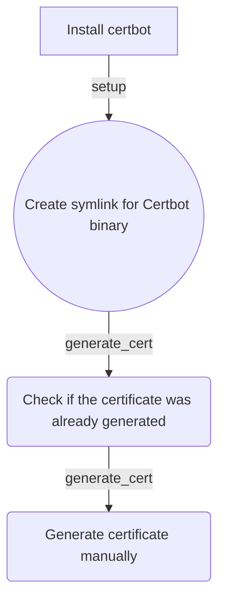

letsencryptssl
=========

Ansible role for setting up certbot and creating a certificate for a domain.



Requirements
------------

To use this role, you need to install the `snap` community role. You can install it using the following command:

```shell
ansible-galaxy collection install community.general
```

Role Variables
--------------

The role uses the following parameters:

- `email`: The email address to use for the certificate.
- `domain`: The domain for which the certificate should be created.

Dependencies
------------

This role depends on the following collections:

- `community.general`
  - `community.general.snap`

Example Playbook
----------------

Here's an example playbook that shows how to use the role:

```yaml
- hosts: servers
  roles:
    - role: letsencryptssl
      email: your_email@example.com
      domain: example.com
```

License
-------

This role is licensed under the MIT License.

Author Information
------------------

This role was created by Rudolf Olah.
